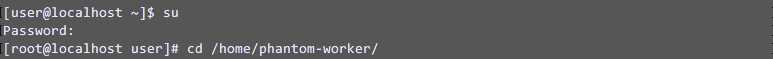
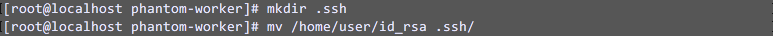
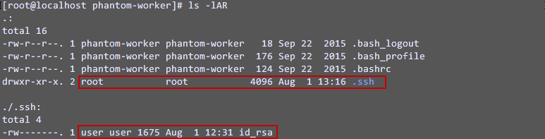
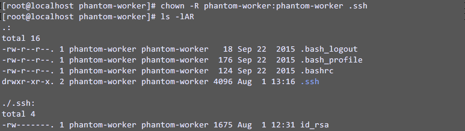

[comment]: # "    File: readme.md"
[comment]: # "    Copyright (c) Phantom Cyber Corporation, 2017"
[comment]: # ""
[comment]: # "Licensed under the Apache License, Version 2.0 (the 'License');"
[comment]: # "you may not use this file except in compliance with the License."
[comment]: # "You may obtain a copy of the License at"
[comment]: # ""
[comment]: # "    http://www.apache.org/licenses/LICENSE-2.0"
[comment]: # ""
[comment]: # "Unless required by applicable law or agreed to in writing, software distributed under"
[comment]: # "the License is distributed on an 'AS IS' BASIS, WITHOUT WARRANTIES OR CONDITIONS OF ANY KIND,"
[comment]: # "either express or implied. See the License for the specific language governing permissions"
[comment]: # "and limitations under the License."
[comment]: # ""
## Root access permissions

If the user you are logging in is root (or is otherwise configured to not need to use sudo), then be
sure to check the "User is root" box in the asset configuration. Otherwise, you will need to provide
a password if you want to run commands that require root access even if an RSA key is specified, as
required by your sudoers configuration. If you incorrectly specify that the account is root, or if
you incorrectly enter a password in conjunction with an RSA key, then the action may indefinitely
hang.

## Key-based authentication

Refer to the following steps to install the authentication keys. Note that the key pair must be
unencrypted and generated using `     ssh-keygen    ` .

Connect to your Phantom instance and sudo to root, then change to the phantom-worker's home
directory.  

Create a directory for the SSH keys (Note: You must give it the name .ssh), then move any private
key files into this directory. In this case, the file `     id_rsa    ` had been added to user's
home directory using scp. It is entirely possible to generate a new key pair from the Phantom VM
using `     ssh-keygen    ` as well.  

Once the files are in the correct place, ownership must be set to phantom-worker.  

Using the `     chown    ` command:  

The RSA key should be ready to use in an SSH asset. Based on the above example, configure this by
specifying id_rsa as the RSA key file.
